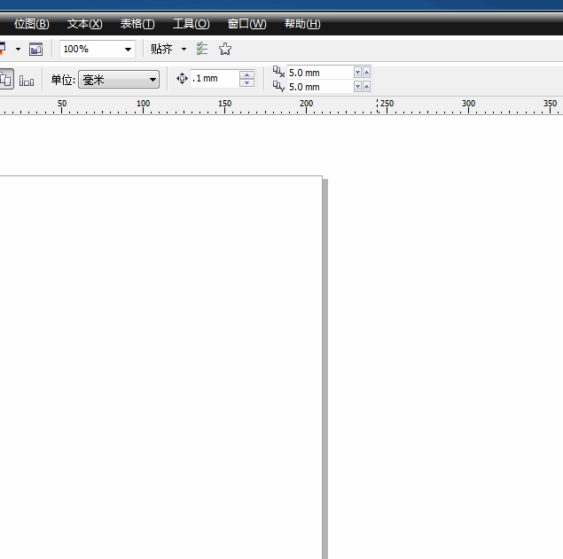
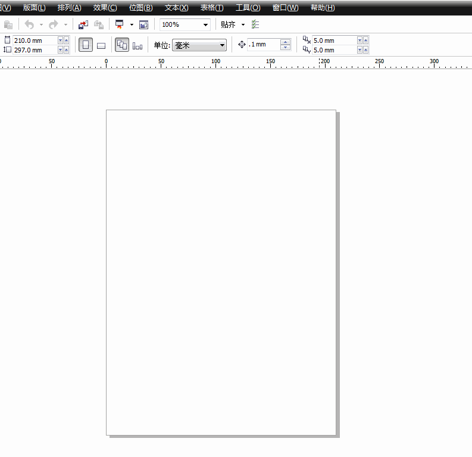
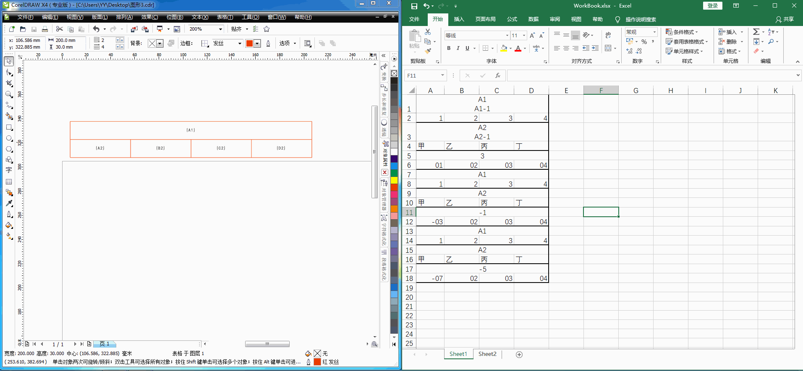
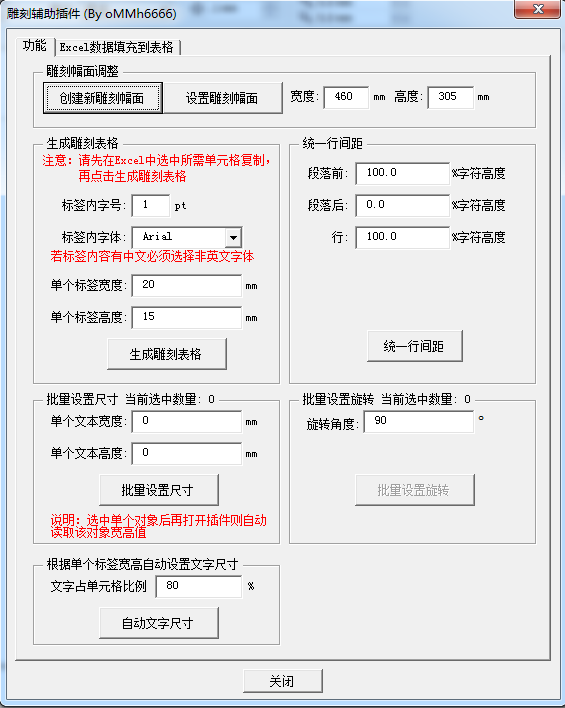
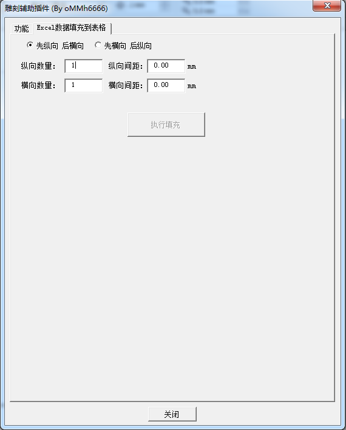

# CurvePlugin
## 功能说明
   1. 将Excel表格里的数据直接通过复制到剪贴板中的方式导入至Coreldraw中直接生成格子形式的矢量图形，主要是以雕刻为目的而设计的

   2. 使用模板的形式对CDR中的表格对象使用Excel文件内的数据进行填充再制到整板，提高雕刻排版的效率

## Coreldraw版本适用
目前仅在Coreldraw X4版本中进行测试，其他版本未测试，自行适配

## 安装方法
1. 复制GMS插件文件（CarvePlugin.gms）至本地Coreldraw GMS插件目录

   1.1 在32位系统下默认安装目录为：C:\Program Files\Corel\CorelDRAW Graphics Suite X4\Draw\GMS

   1.2 在64位系统下默认安装目录为：C:\Program Files (x86)\Corel\CorelDRAW Graphics Suite X4\Draw\GMS

   1.3 操作视频：
   

2. 将插件拖动至工具栏变为图标

   操作视频：
   

3. 删除工具栏图标的方法

   操作视频：
   

## 去除粘贴并导入本文时的警告信息：

   操作视频：
   

## 使用方法

   1. 选择插件的图标

   2. 点击按钮，弹出界面

## 填充表格功能的方法及演示

   1. 在CDR中画好需要的表格样式 单元格的文本填写格式为 大括号内单元格名
      例：{A1} 标签：{A1}
      程序会自动替换{单元格}这种形式的文本为Excel单元格的内容
   
   2. 准备好Exccel表格文件，格式无关紧要，只需要保证其数据
      在使用插件前需先关闭Excel表格文件，插件会把读取过的单元格重标底色为红色

   2. 在CDR中选中该表格

   3. 点开插件（插件会根据当前选择的表格大小自动计算幅面内可放置的数量）
      有两种排列形式可选：先纵向后横向 先横向后纵向

   4. 点击执行填充（选择Excel文件）

   5. 等待填充完成

   6. 打开原来的Excel文件，可见处理过的单元格已被重标底色为红色

   操作视频：
   

## 界面预览

